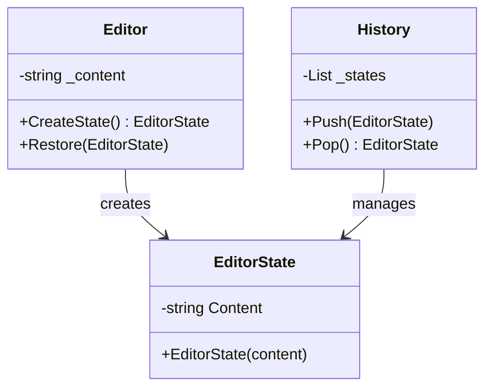

# Memento Pattern

## Problem

📌  
Applications often need to save and restore an object's state (e.g., undo/redo operations). Directly exposing an object's internal state breaks encapsulation and introduces maintenance challenges.

## Solution

✅  
The Memento Pattern provides:

- **Originator**: Creates state snapshots (`Editor`)
- **Memento**: Immutable state container (`EditorState`)
- **Caretaker**: Manages state history (`History`)

State management is decoupled from business logic while preserving encapsulation.

## Use Cases

🔍

- Text editor undo/redo
- Game save/load systems
- Transaction rollbacks in databases
- Version control systems

## Structure

⌨️



## C# Implementation

### Editor (Originator)

```csharp
public class Editor
{
    private string _content;

    // Captures current state as immutable snapshot
    public EditorState CreateState() => new EditorState(_content);

    // Restores from previously saved state
    public void Restore(EditorState state) => _content = state.Content;

    public string Content
    {
        get => _content;
        set => _content = value;
    }
}
```

### EditorState (Memento)

```csharp
public class EditorState
{
    // Frozen state - cannot be modified after creation
    public string Content { get; }

    public EditorState(string content) => Content = content;
}
```

### History (Caretaker)

```csharp
public class History
{
    private readonly List<EditorState> _states = new();

    // Stores state in LIFO order
    public void Push(EditorState state) => _states.Add(state);

    // Retrieves and removes latest state
    public EditorState Pop()
    {
        if (_states.Count == 0)
            throw new InvalidOperationException("No states to undo");

        var lastIndex = _states.Count - 1;
        var lastState = _states[lastIndex];
        _states.RemoveAt(lastIndex);
        return lastState;
    }
}
```

## Usage

```csharp
var editor = new Editor();
var history = new History();

// Edit 1: Create and save state
editor.Content = "First draft";
history.Push(editor.CreateState());

// Edit 2: Create and save updated state
editor.Content = "Second draft";
history.Push(editor.CreateState());

// Undo to previous version
editor.Restore(history.Pop());
Console.WriteLine(editor.Content); // Output: "First draft"
```

## Key Points

🔑

- **Immutable Mementos**: Once created, states cannot change
- **Single Responsibility**: History management is separate from core editor logic
- **Performance**: Consider limiting history size for memory-sensitive applications
- **Encapsulation**: Editor's internal state remains private
