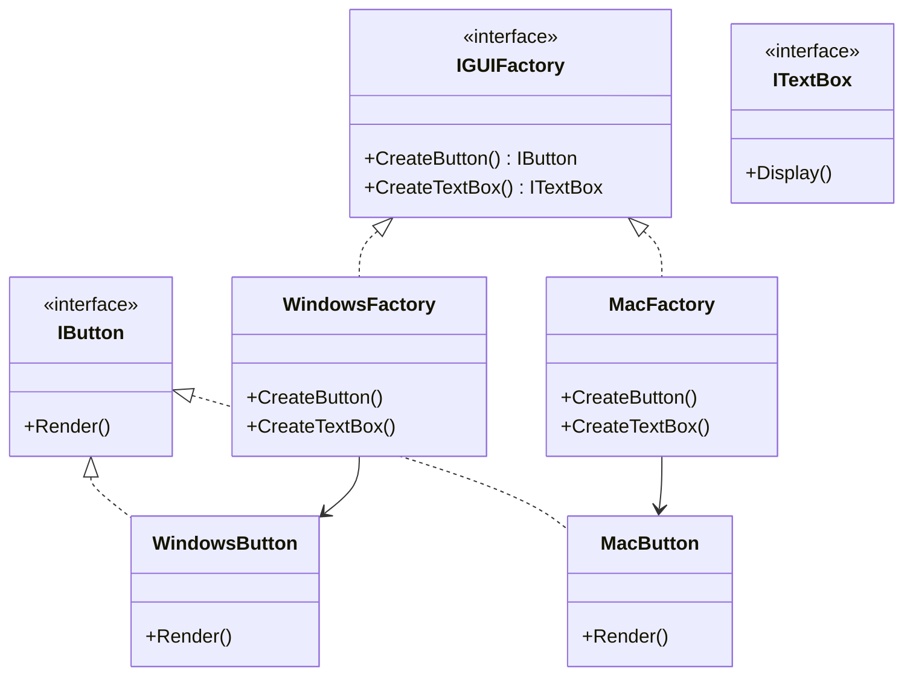

# Abstract Factory Pattern

## Problem

🌐  
Need to create **families of related objects** while:

- Ensuring compatibility between products
- Supporting multiple product variants
- Hiding concrete implementations from clients
- Preventing mixed incompatible object types

## Solution

🏗️  
Provide interface for creating object families:

- **Abstract Factory**: Declares creation methods for all products
- **Concrete Factories**: Implement creation for specific product families
- **Abstract Products**: Interfaces for product types
- **Concrete Products**: Family-specific implementations

## Use Cases

🎨

- Cross-platform UI frameworks
- Database abstraction layers
- Theme systems (dark/light mode)
- Game engine asset pipelines
- OS-specific device drivers

## How to Implement (OOP Steps)

1️⃣ **Define Abstract Products**

- Interfaces for each product type
- _Type:_ Interfaces (`IButton`, `ITextBox`)

2️⃣ **Create Concrete Products**

- Implement product interfaces per family
- _Type:_ Concrete classes (`WindowsButton`, `MacButton`)

3️⃣ **Declare Abstract Factory**

- Methods to create all product types
- _Type:_ Interface (`IGUIFactory`)

4️⃣ **Implement Concrete Factories**

- Create matching product family
- _Type:_ Concrete classes (`WindowsFactory`, `MacFactory`)

5️⃣ **Client Code**

- Works with factory/products through interfaces
- _Type:_ Configuration-dependent class

## Structure

⌨️



## C# Implementation

### Abstract Products

```csharp
public interface IButton
{
    void Render();
}

public interface ITextBox
{
    void Display();
}
```

### Concrete Products (Windows Family)

```csharp
public class WindowsButton : IButton
{
    public void Render()
    {
        Console.WriteLine("Rendering Windows-style button");
    }
}

public class WindowsTextBox : ITextBox
{
    public void Display()
    {
        Console.WriteLine("Displaying Windows textbox");
    }
}
```

### Concrete Products (Mac Family)

```csharp
public class MacButton : IButton
{
    public void Render()
    {
        Console.WriteLine("Drawing macOS button with rounded corners");
    }
}

public class MacTextBox : ITextBox
{
    public void Display()
    {
        Console.WriteLine("Showing macOS floating text field");
    }
}
```

### Abstract Factory

```csharp
public interface IGUIFactory
{
    IButton CreateButton();
    ITextBox CreateTextBox();
}
```

### Concrete Factories

```csharp
public class WindowsFactory : IGUIFactory
{
    public IButton CreateButton() => new WindowsButton();
    public ITextBox CreateTextBox() => new WindowsTextBox();
}

public class MacFactory : IGUIFactory
{
    public IButton CreateButton() => new MacButton();
    public ITextBox CreateTextBox() => new MacTextBox();
}
```

## Usage

```csharp
class GUIApplication
{
    private readonly IButton _button;
    private readonly ITextBox _textBox;

    public GUIApplication(IGUIFactory factory)
    {
        _button = factory.CreateButton();
        _textBox = factory.CreateTextBox();
    }

    public void RenderUI()
    {
        _button.Render();
        _textBox.Display();
    }
}

// Client code
var os = "mac"; // Configurable value

IGUIFactory factory = os switch
{
    "windows" => new WindowsFactory(),
    "mac" => new MacFactory(),
    _ => throw new NotSupportedException()
};

var app = new GUIApplication(factory);
app.RenderUI();

/* Output (for Mac):
Drawing macOS button with rounded corners
Showing macOS floating text field
*/
```

## Key Points

🔑

- **Product Families**: Ensures compatible object combinations
- **Runtime Flexibility**: Switch entire families at startup
- **Consistent Interfaces**: Uniform creation across product types
- **Decoupling**: Client code works with interfaces only

## Code Comments

- **IGUIFactory**: Creation contract for UI components
- **Concrete Factories**: Platform-specific implementations
- **IButton/ITextBox**: Cross-platform component contracts
- **GUIApplication**: Client code unaware of concrete types

## Variations

- **Dynamic Factories**: Load factories via configuration
- **Hybrid Factories**: Mix products from different families
- **Singleton Factories**: Single instance per factory type
- **Cached Factories**: Reuse product instances

## Anti-Pattern Warnings

⚠️

- Overkill for single-product scenarios
- Difficult to support new product types
- Tight coupling between factory and product interfaces
- Complex maintenance with many product families
