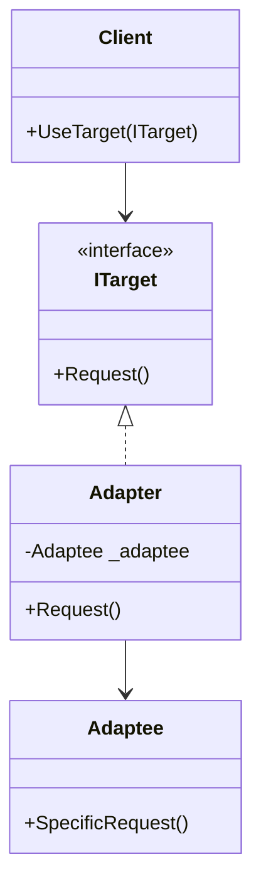

# Adapter Pattern

## Problem

🔌  
Need to integrate components with incompatible interfaces. Common when:

- Using third-party libraries
- Migrating legacy systems
- Working with incompatible data formats

## Solution

🔧  
Create a bridge between two incompatible interfaces using:

- **Target**: Interface clients expect
- **Adaptee**: Existing incompatible interface
- **Adapter**: Converts Adaptee's interface to Target's

## Use Cases

🔄

- Legacy system integration
- API version compatibility
- Data format conversions (XML ↔ JSON)
- Hardware interface wrappers

## How to Implement (OOP Steps)

1️⃣ **Define Target Interface**

- What clients expect to work with
- _Type:_ Interface (`ITarget`)

2️⃣ **Identify Adaptee Class**

- Existing class with incompatible interface
- _Type:_ Concrete class (third-party/legacy)

3️⃣ **Create Adapter Class**

- Implements Target interface
- Contains/wraps Adaptee instance
- _Type:_ Concrete class

4️⃣ **Client Code**

- Works with Target interface
- Unaware of Adaptee existence

## Structure

⌨️



## C# Implementation

### Target Interface

```csharp
public interface IAnalyticsService
{
    string ProcessData(string xmlData);
}
```

### Adaptee (Third-Party Service)

```csharp
public class ThirdPartyJsonAnalytics
{
    public string AnalyzeJson(string jsonData)
    {
        // Actual analysis logic
        return $"Analyzed: {jsonData}";
    }
}
```

### Adapter

```csharp
public class JsonToXmlAdapter : IAnalyticsService
{
    private readonly ThirdPartyJsonAnalytics _adaptee;

    public JsonToXmlAdapter(ThirdPartyJsonAnalytics adaptee)
    {
        _adaptee = adaptee;
    }

    public string ProcessData(string xmlData)
    {
        // Convert XML to JSON
        var jsonData = ConvertXmlToJson(xmlData);

        // Use Adaptee's method
        return _adaptee.AnalyzeJson(jsonData);
    }

    private string ConvertXmlToJson(string xml)
    {
        // Simplified conversion logic
        return xml.Replace("<", "{").Replace(">", "}");
    }
}
```

## Usage

```csharp
// Existing legacy service
var jsonService = new ThirdPartyJsonAnalytics();

// Create adapter
var adapter = new JsonToXmlAdapter(jsonService);

// Client works with standard interface
var client = new AnalyticsClient();
var result = client.UseService(adapter, "<data>test</data>");

Console.WriteLine(result); // "Analyzed: {data}test{/data}"
```

## Key Points

🔑

- **Interface Conversion**: Translates between incompatible interfaces
- **Loose Coupling**: Client unaware of adapter/adaptee
- **Two-Way Adaptation**: Can convert in both directions
- **Class vs Object Adapters**: Inheritance vs composition

## Code Comments

- **ITarget**: Client-facing contract
- **ThirdPartyJsonAnalytics**: Existing service (untouched)
- **JsonToXmlAdapter**: Bridges XML ↔ JSON gap
- **ConvertXmlToJson**: Simulated conversion logic

## Variations

- **Class Adapter**: Inherits from Adaptee (requires multiple inheritance)
- **Two-Way Adapter**: Implements both interfaces
- **Pluggable Adapters**: Configurable conversion rules
