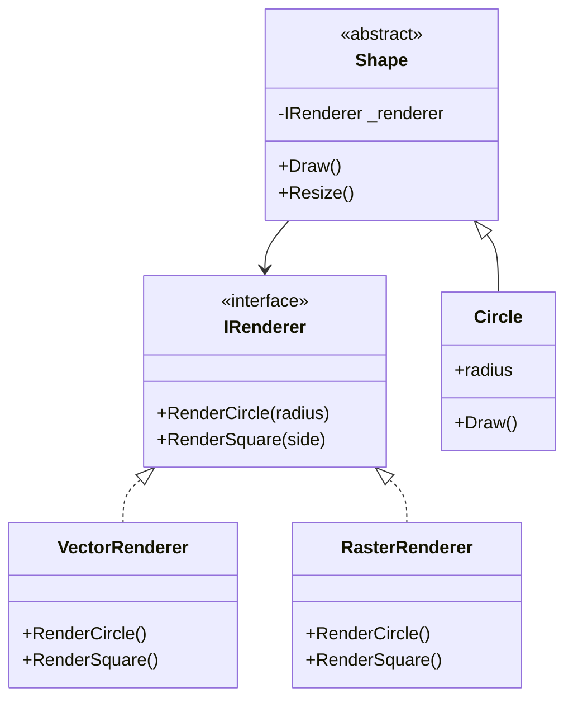

# Bridge Pattern

## Problem

🌉  
Need to separate abstractions from implementations to:

- Avoid permanent binding between layers
- Prevent class explosion from multiple dimensions
- Enable independent evolution of components

## Solution

🛠️  
Decouple abstraction hierarchy from implementation using:

- **Abstraction**: High-level control layer (interface)
- **Implementation**: Platform-specific details (interface)
- **Bridge**: Connects abstraction to implementation via composition

## Use Cases

📱

- Cross-platform UI frameworks
- Database drivers
- Device controllers
- Multi-format exporters

## How to Implement (OOP Steps)

1️⃣ **Define Implementation Interface**

- Core operations implementations must provide
- _Type:_ Interface (`IRenderer`)

2️⃣ **Create Concrete Implementations**

- Platform-specific functionality
- _Type:_ Concrete classes (`VectorRenderer`, `RasterRenderer`)

3️⃣ **Build Abstraction Hierarchy**

- High-level operations using implementation
- _Type:_ Abstract class (`Shape`)

4️⃣ **Develop Refined Abstractions**

- Specialized versions of abstraction
- _Type:_ Concrete classes (`Circle`, `Square`)

5️⃣ **Connect via Bridge**

- Abstraction maintains implementation reference
- _Type:_ Composition in base abstraction

## Structure

⌨️



## C# Implementation

### Implementation Interface

```csharp
public interface IRenderer
{
    void RenderCircle(float radius);
    void RenderSquare(float side);
}
```

### Concrete Implementations

```csharp
public class VectorRenderer : IRenderer
{
    public void RenderCircle(float radius)
    {
        Console.WriteLine($"Drawing circle with radius {radius} using vectors");
    }

    public void RenderSquare(float side)
    {
        Console.WriteLine($"Drawing square with side {side} using vectors");
    }
}

public class RasterRenderer : IRenderer
{
    public void RenderCircle(float radius)
    {
        Console.WriteLine($"Rasterizing circle of radius {radius}");
    }

    public void RenderSquare(float side)
    {
        Console.WriteLine($"Rasterizing square with side {side}");
    }
}
```

### Abstraction Hierarchy

```csharp
public abstract class Shape
{
    protected IRenderer Renderer;

    protected Shape(IRenderer renderer)
    {
        Renderer = renderer;
    }

    public abstract void Draw();
    public abstract void Resize(float factor);
}

public class Circle : Shape
{
    private float _radius;

    public Circle(IRenderer renderer, float radius) : base(renderer)
    {
        _radius = radius;
    }

    public override void Draw()
    {
        Renderer.RenderCircle(_radius);
    }

    public override void Resize(float factor)
    {
        _radius *= factor;
    }
}
```

## Usage

```csharp
IRenderer vector = new VectorRenderer();
IRenderer raster = new RasterRenderer();

var vectorCircle = new Circle(vector, 5);
var rasterSquare = new Square(raster, 10);

vectorCircle.Draw();  // Drawing circle with radius 5 using vectors
rasterSquare.Draw();  // Rasterizing square with side 10

vectorCircle.Resize(2);
vectorCircle.Draw();  // Drawing circle with radius 10 using vectors
```

## Key Points

🔑

- **Decoupled Layers**: Change renderers without touching shapes
- **Runtime Binding**: Switch implementations dynamically
- **Reduced Complexity**: Avoids N\*M class combinations
- **Open/Closed**: New implementations don't affect abstractions

## Code Comments

- **IRenderer**: Platform-agnostic rendering contract
- **VectorRenderer**: SVG/vector-based implementation
- **RasterRenderer**: Bitmap/pixel-based implementation
- **Shape**: Base abstraction with renderer reference
- **Circle**: Refined abstraction using bridge

## Variations

- **Multiple Bridges**: Connect to multiple implementations
- **Default Implementations**: Provide base renderer class
- **Bridge Factories**: Dynamic implementation selection
- **Stateful Bridges**: Change implementation at runtime
