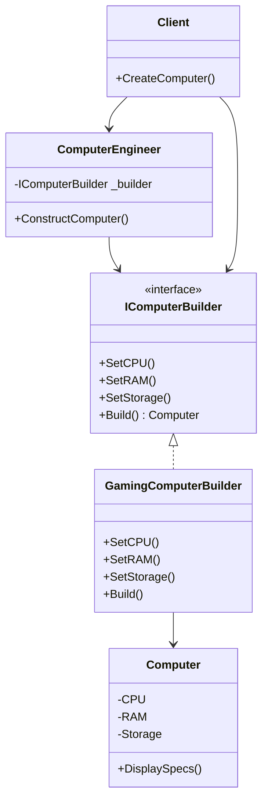

# Builder Pattern

## Problem

🏗️  
Need to create **complex objects** with many parts when:

- Object requires step-by-step construction
- Multiple representation variations are needed
- Construction process should be independent of components
- Avoid telescoping constructor anti-pattern

## Solution

🔨  
Separate object construction from representation:

- **Builder Interface**: Defines construction steps
- **Concrete Builder**: Implements construction steps
- **Director**: Orchestrates building process (optional)
- **Product**: Final complex object

## Use Cases

📦

- Meal combos (burger, drink, fries)
- Document converters (HTML, PDF, Markdown)
- Computer configuration systems
- UI layout builders
- Query generators

## How to Implement (OOP Steps)

1️⃣ **Create Product Class**

- Complex object with multiple parts
- _Type:_ Concrete class (`Computer`)

2️⃣ **Define Builder Interface**

- Declares methods for building parts
- _Type:_ Interface (`IComputerBuilder`)

3️⃣ **Implement Concrete Builders**

- Provide specific implementations for parts
- _Type:_ Concrete classes (`GamingComputerBuilder`)

4️⃣ **Add Director (Optional)**

- Manages construction steps
- _Type:_ Concrete class (`ComputerEngineer`)

5️⃣ **Client Code**

- Controls builder/director to create product
- _Type:_ Configuration-dependent code

## Structure

⌨️



## C# Implementation

### Product Class

```csharp
public class Computer
{
    public string CPU { get; set; }
    public string RAM { get; set; }
    public string Storage { get; set; }
    public bool GPU { get; set; }

    public void DisplaySpecs()
    {
        Console.WriteLine($"CPU: {CPU}");
        Console.WriteLine($"RAM: {RAM}");
        Console.WriteLine($"Storage: {Storage}");
        Console.WriteLine($"GPU: {(GPU ? "Yes" : "No")}");
    }
}
```

### Builder Interface

```csharp
public interface IComputerBuilder
{
    void SetCPU(string cpu);
    void SetRAM(string ram);
    void SetStorage(string storage);
    void AddGPU();
    Computer Build();
}
```

### Concrete Builder

```csharp
public class GamingComputerBuilder : IComputerBuilder
{
    private Computer _computer = new Computer();

    public void SetCPU(string cpu)
    {
        _computer.CPU = $"{cpu} (Overclocked)";
    }

    public void SetRAM(string ram)
    {
        _computer.RAM = $"{ram} DDR5 RGB";
    }

    public void SetStorage(string storage)
    {
        _computer.Storage = $"{storage} NVMe SSD";
    }

    public void AddGPU()
    {
        _computer.GPU = true;
    }

    public Computer Build()
    {
        return _computer;
    }
}
```

### Director (Optional)

```csharp
public class ComputerEngineer
{
    private readonly IComputerBuilder _builder;

    public ComputerEngineer(IComputerBuilder builder)
    {
        _builder = builder;
    }

    public Computer ConstructComputer()
    {
        _builder.SetCPU("Intel i9-13900K");
        _builder.SetRAM("32GB");
        _builder.SetStorage("2TB");
        _builder.AddGPU();
        return _builder.Build();
    }
}
```

## Usage

```csharp
// Without Director
var builder = new GamingComputerBuilder();
builder.SetCPU("AMD Ryzen 9 7950X");
builder.SetRAM("64GB");
builder.SetStorage("4TB");
builder.AddGPU();
var highEndPc = builder.Build();

// With Director
var officeBuilder = new OfficeComputerBuilder();
var engineer = new ComputerEngineer(officeBuilder);
var officePc = engineer.ConstructComputer();

// Show specs
highEndPc.DisplaySpecs();
/* Output:
CPU: AMD Ryzen 9 7950X (Overclocked)
RAM: 64GB DDR5 RGB
Storage: 4TB NVMe SSD
GPU: Yes
*/
```

## Key Points

🔑

- **Step-by-Step Construction**: Complex object assembly
- **Variety of Representations**: Different builders create different products
- **Isolated Construction**: Same process can create different representations
- **Reusable Configuration**: Preset configurations via Director

## Code Comments

- **IComputerBuilder**: Construction contract
- **GamingComputerBuilder**: Specialized component assembly
- **ComputerEngineer**: Reusable configuration templates
- **Build()**: Finalizes and returns product

## Variations

- **Fluent Interface**: Method chaining (return `this`)
- **Composite Builder**: Build complex object hierarchies
- **Step Builder**: Enforce construction order
- **Null Builder**: Default configurations

## Anti-Pattern Warnings

⚠️

- Over-engineering for simple objects
- Unnecessary abstraction layers
- Builder-Director coupling
- Inconsistent product states
