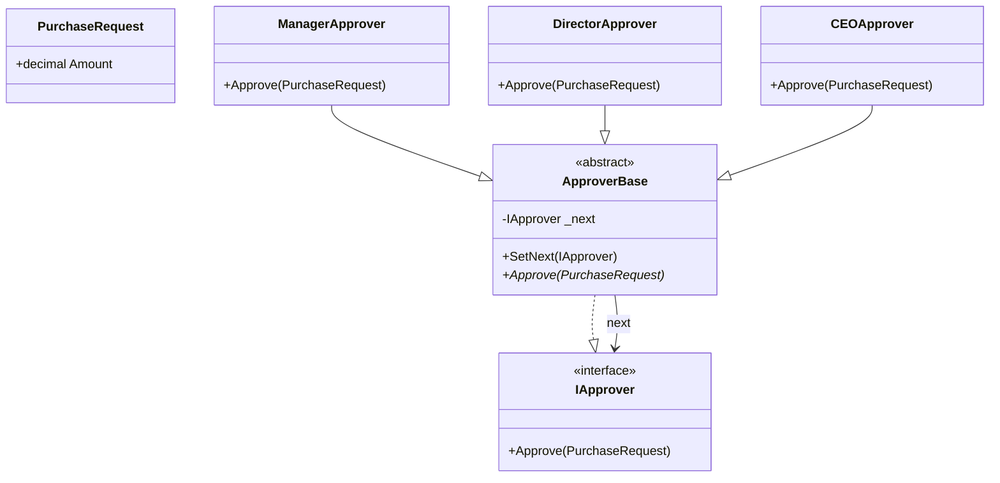

# Chain of Responsibility Pattern

## Problem

⛓️  
Requests need multiple levels of processing/approval without hard-coding handlers. Need to:

- Avoid coupling sender to specific receivers
- Allow dynamic handler sequences
- Enable flexible processing pipelines

## Solution

🛂  
Create handler chain where each:

- Processes request **OR**
- Passes to next handler
  Components:
- **Handler Interface**: Defines handling contract
- **Concrete Handlers**: Processing logic + next handler reference
- **Client**: Builds and triggers chain

## Use Cases

🏦

- Purchase approvals
- Logging pipelines
- Event filtering
- Authentication middleware
- Error handling

## Structure

⌨️



## C# Implementation

### Request Object

```csharp
public class PurchaseRequest
{
    public decimal Amount { get; }

    public PurchaseRequest(decimal amount)
    {
        Amount = amount;
    }
}
```

### Handler Interface

```csharp
public interface IApprover
{
    void Approve(PurchaseRequest request);
}
```

### Base Approver (Abstract)

```csharp
public abstract class ApproverBase : IApprover
{
    private IApprover _next;

    public IApprover SetNext(IApprover next)
    {
        _next = next;
        return next;
    }

    public virtual void Approve(PurchaseRequest request)
    {
        if (CanApprove(request))
        {
            ProcessApproval(request);
        }
        else if (_next != null)
        {
            _next.Approve(request);
        }
        else
        {
            Console.WriteLine("Request requires board meeting!");
        }
    }

    protected abstract bool CanApprove(PurchaseRequest request);
    protected abstract void ProcessApproval(PurchaseRequest request);
}
```

### Concrete Handlers

```csharp
public class ManagerApprover : ApproverBase
{
    protected override bool CanApprove(PurchaseRequest request)
    {
        return request.Amount <= 1000;
    }

    protected override void ProcessApproval(PurchaseRequest request)
    {
        Console.WriteLine($"Manager approved ${request.Amount} purchase");
    }
}

public class DirectorApprover : ApproverBase
{
    protected override bool CanApprove(PurchaseRequest request)
    {
        return request.Amount <= 5000;
    }

    protected override void ProcessApproval(PurchaseRequest request)
    {
        Console.WriteLine($"Director approved ${request.Amount} purchase");
    }
}

public class CEOApprover : ApproverBase
{
    protected override bool CanApprove(PurchaseRequest request)
    {
        return request.Amount <= 10000;
    }

    protected override void ProcessApproval(PurchaseRequest request)
    {
        Console.WriteLine($"CEO approved ${request.Amount} purchase");
    }
}
```

## Usage

```csharp
var manager = new ManagerApprover();
var director = new DirectorApprover();
var ceo = new CEOApprover();

// Build chain
manager.SetNext(director).SetNext(ceo);

// Process requests
manager.Approve(new PurchaseRequest(800));    // Manager handles
manager.Approve(new PurchaseRequest(4500));   // Director handles
manager.Approve(new PurchaseRequest(9500));   // CEO handles
manager.Approve(new PurchaseRequest(15000));  // No handler

/* Output:
Manager approved $800 purchase
Director approved $4500 purchase
CEO approved $9500 purchase
Request requires board meeting!
*/
```

## Key Points

🔑

- **Flexible Chains**: Handlers can be reordered/added/removed
- **Single Responsibility**: Each handler has clear approval limits
- **Fallback Handling**: Final catch-all case
- **Implicit Control Flow**: No complex conditional logic

## Code Comments

- **ApproverBase**: Implements chain logic template
- **SetNext**: Fluent interface for building chains
- **CanApprove**: Decision logic in concrete classes
- **ProcessApproval**: Handler-specific implementation

## Variations

- **Early Exit**: Return after processing to stop chain
- **Multiple Handlers**: Allow multiple handlers to process
- **Asynchronous**: Pass along async/await chain
- **Conditional Links**: Dynamic next handler selection
