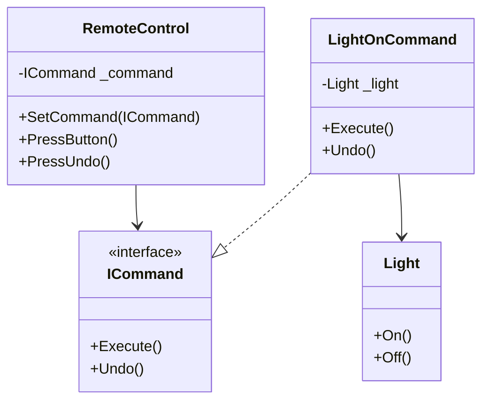

# Command Pattern

## Problem

🎮  
Need to decouple:

- Object making requests (`Invoker`)
- Object performing actions (`Receiver`)
- When you need parameterized operations, queuing, or undo/redo functionality

## Solution

🕹️  
Encapsulate requests as command objects containing:

- Action to perform
- Parameters for the action
- Receiver reference

Components:

- **Command**: Interface with `Execute()` method
- **Concrete Command**: Implements action on receiver
- **Invoker**: Triggers commands
- **Receiver**: Knows how to perform operations

## Use Cases

💡

- GUI buttons/menu items
- Multi-level undo/redo
- Macro recording
- Transactional operations
- Job queues

## Structure

⌨️



## C# Implementation

### Command Interface

```csharp
public interface ICommand
{
    void Execute();
    void Undo();
}
```

### Receiver

```csharp
public class Light
{
    public void On() => Console.WriteLine("Light is ON");
    public void Off() => Console.WriteLine("Light is OFF");
}
```

### Concrete Command

```csharp
public class LightOnCommand : ICommand
{
    private readonly Light _light;

    public LightOnCommand(Light light)
    {
        _light = light;
    }

    public void Execute() => _light.On();

    public void Undo() => _light.Off();
}
```

### Invoker

```csharp
public class RemoteControl
{
    private ICommand _command;

    public void SetCommand(ICommand command)
    {
        _command = command;
    }

    public void PressButton()
    {
        _command?.Execute();
    }

    public void PressUndo()
    {
        _command?.Undo();
    }
}
```

## Usage

```csharp
var light = new Light();
var remote = new RemoteControl();

// Configure command
remote.SetCommand(new LightOnCommand(light));

// Execute
remote.PressButton();  // Output: Light is ON

// Undo
remote.PressUndo();    // Output: Light is OFF

// Can easily swap commands:
remote.SetCommand(new DimLightCommand(light, 50));
remote.PressButton();  // Custom dimming logic
```

## Key Points

🔑

- **Decoupling**: Invoker doesn't know about receiver
- **Undo/Redo**: Easy to implement command history
- **Composite Commands**: Combine multiple commands
- **Queueing**: Commands can be stored and executed later
- **Logging**: Record all executed commands

## Code Comments

- **ICommand**: Contract for all command operations
- **Concrete Commands**: Contain receiver and parameters
- **RemoteControl**: Just triggers commands, no business logic
- **Light**: Actual implementation of actions

## Advanced Extensions

- **Command History Stack**: For unlimited undo/redo
- **Macro Commands**: Execute multiple commands sequentially
- **Transactional Commands**: Rollback on failure
