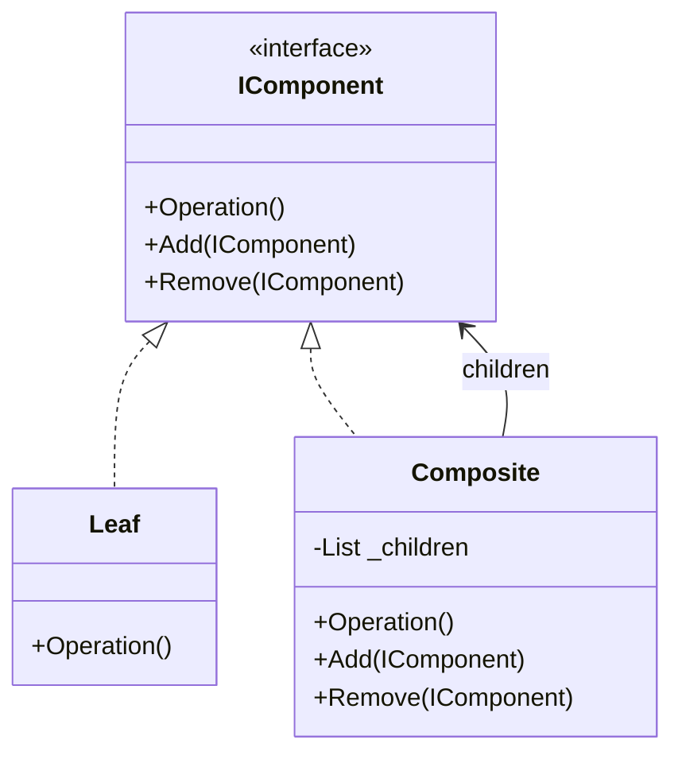

# Composite Pattern

## Problem

🌳  
Need to treat individual objects and compositions uniformly. Common when:

- Working with tree-structured hierarchies
- Clients shouldn't care about object/node types
- Need recursive operations over part-whole hierarchies

## Solution

🌿  
Compose objects into tree structures:

- **Component**: Common interface for all elements
- **Leaf**: Individual objects (no children)
- **Composite**: Containers that store components

## Use Cases

📂

- Graphic systems (shapes/groups)
- File/folder structures
- UI layouts (nested components)
- Organization hierarchies

## How to Implement (OOP Steps)

1️⃣ **Create Component Interface/Abstract Class**

- Declares common operations (`Operation()`, `Add()`, `Remove()`)
- _Type:_ Abstract class or interface

2️⃣ **Implement Leaf Components**

- Defines behavior for primitive objects
- _Type:_ Concrete class (implements Component)

3️⃣ **Create Composite Class**

- Stores child components (List<Component>)
- Implements child management methods
- _Type:_ Concrete class (implements Component)

4️⃣ **Client Code**

- Works with Components through interface
- Treats Leaf/Composite uniformly

## Structure

⌨️



## C# Implementation

### Component Interface

```csharp
public interface IComponent
{
    void Operation();
    void Add(IComponent component);
    void Remove(IComponent component);
}
```

### Leaf Component

```csharp
public class File : IComponent
{
    private readonly string _name;

    public File(string name) => _name = name;

    public void Operation()
    {
        Console.WriteLine($"Operating on file: {_name}");
    }

    // Leaf cannot have children
    public void Add(IComponent component) =>
        throw new NotSupportedException();

    public void Remove(IComponent component) =>
        throw new NotSupportedException();
}
```

### Composite Component

```csharp
public class Folder : IComponent
{
    private readonly List<IComponent> _children = new();
    private readonly string _name;

    public Folder(string name) => _name = name;

    public void Operation()
    {
        Console.WriteLine($"Operating on folder: {_name}");
        foreach (var child in _children)
        {
            child.Operation();
        }
    }

    public void Add(IComponent component)
    {
        _children.Add(component);
    }

    public void Remove(IComponent component)
    {
        _children.Remove(component);
    }
}
```

## Usage

```csharp
var root = new Folder("Root");
var documents = new Folder("Documents");
var file1 = new File("resume.pdf");
var file2 = new File("notes.txt");

root.Add(documents);
documents.Add(file1);
documents.Add(file2);

// Unified operation call
root.Operation();

/* Output:
Operating on folder: Root
Operating on folder: Documents
Operating on file: resume.pdf
Operating on file: notes.txt
*/
```

## Key Points

🔑

- **Uniform Treatment**: Same interface for Leaf/Composite
- **Recursive Composition**: Composites can contain other Composites
- **Transparent vs Safe**: Trade-off between unified interface and child management
- **Tree Traversal**: Built-in through composite operations

## Code Comments

- **IComponent**: Common contract (consider base class for default impl)
- **File**: Leaf with no children (throws on Add/Remove)
- **Folder**: Composite with child management
- **Operation()**: Recursive in composite, terminal in leaf
