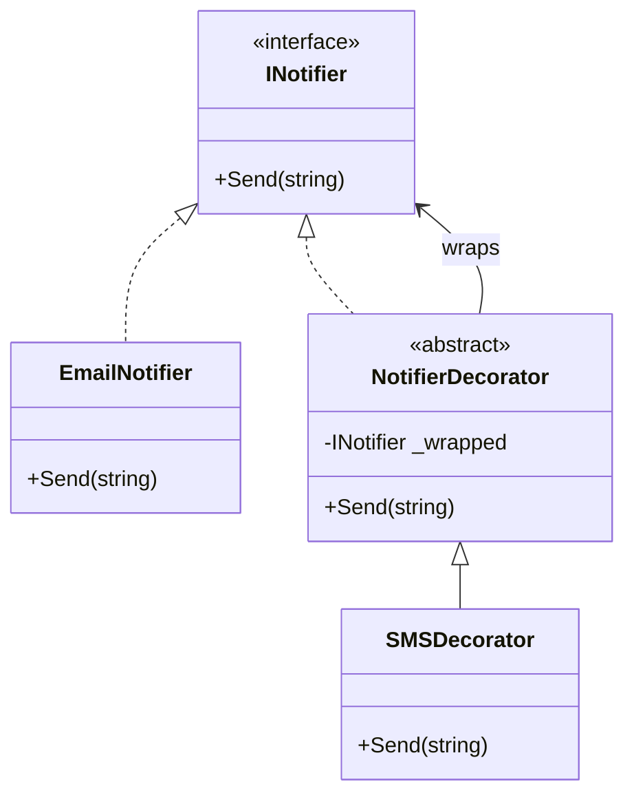

# Decorator Pattern

## Problem

🎁  
Need to add responsibilities to objects **dynamically** without:

- Creating rigid class hierarchies
- Affecting other objects of same class
- Using inheritance for extension

## Solution

🪆  
Wrap objects in special decorator classes that:

- Implement same interface as component
- Add/modify behavior before/after delegating to wrapped object

## Use Cases

📈

- Adding logging/validation to services
- Stream encryption/compression
- GUI element enhancements (borders, scrollbars)
- Middleware pipelines

## How to Implement (OOP Steps)

1️⃣ **Define Component Interface**

- Core operations to be decorated
- _Type:_ Interface (`INotifier`)

2️⃣ **Create Concrete Component**

- Basic implementation of component
- _Type:_ Concrete class (`EmailNotifier`)

3️⃣ **Implement Base Decorator**

- Wraps component reference
- _Type:_ Abstract class (`NotifierDecorator`)

4️⃣ **Build Concrete Decorators**

- Add specific functionalities
- _Type:_ Concrete classes (`SMSDecorator`, `SlackDecorator`)

5️⃣ **Client Code**

- Compose decorators at runtime
- Treat all components uniformly

## Structure

⌨️



## C# Implementation

### Component Interface

```csharp
public interface INotifier
{
    void Send(string message);
}
```

### Concrete Component

```csharp
public class EmailNotifier : INotifier
{
    public void Send(string message)
    {
        Console.WriteLine($"Email: {message}");
    }
}
```

### Base Decorator

```csharp
public abstract class NotifierDecorator : INotifier
{
    protected readonly INotifier _wrapped;

    protected NotifierDecorator(INotifier notifier)
    {
        _wrapped = notifier;
    }

    public virtual void Send(string message)
    {
        _wrapped?.Send(message);
    }
}
```

### Concrete Decorators

```csharp
public class SMSDecorator : NotifierDecorator
{
    public SMSDecorator(INotifier notifier) : base(notifier) { }

    public override void Send(string message)
    {
        base.Send(message);
        Console.WriteLine($"SMS: {message}");
    }
}

public class SlackDecorator : NotifierDecorator
{
    public SlackDecorator(INotifier notifier) : base(notifier) { }

    public override void Send(string message)
    {
        Console.WriteLine($"Slack pre-processing: {message.Length} chars");
        base.Send(message);
    }
}
```

## Usage

```csharp
INotifier notifier = new EmailNotifier();

// Add SMS capability
notifier = new SMSDecorator(notifier);

// Add Slack capability
notifier = new SlackDecorator(notifier);

// Execute all notifications
notifier.Send("Server down!");

/* Output:
Slack pre-processing: 11 chars
Email: Server down!
SMS: Server down!
*/
```

## Key Points

🔑

- **Transparent Wrapping**: Clients treat components and decorators identically
- **Recursive Composition**: Decorators can wrap other decorators
- **Single Responsibility**: Each decorator handles one enhancement
- **Runtime Flexibility**: Combine features dynamically

## Code Comments

- **INotifier**: Core messaging contract
- **EmailNotifier**: Basic implementation without decorations
- **NotifierDecorator**: Base class for all enhancements
- **SMSDecorator**: Adds SMS after core notification
- **SlackDecorator**: Adds pre-processing before core

## Variations

- **Interface Decorators**: Implement multiple interfaces
- **Stateful Decorators**: Maintain additional state
- **Decorator Removal**: Implement unwrapping mechanism
- **Lazy Decorators**: Delay initialization until needed
