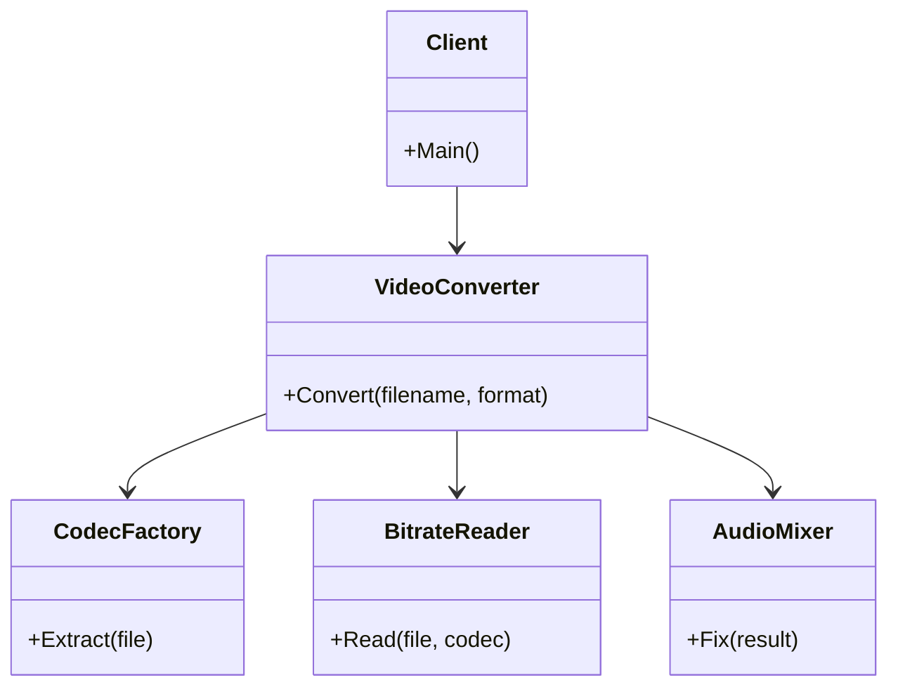

# Facade Pattern

## Problem

🏗️  
Complex subsystems with multiple components lead to:

- Steep learning curve for clients
- Tight coupling between client code and implementation details
- Difficulties in refactoring and maintenance

## Solution

🎭  
Provide a unified interface to a set of interfaces in a subsystem:

- **Facade**: Simplified entry point for common tasks
- **Subsystem Classes**: Existing complex components
- **Client**: Interacts only with facade

## Use Cases

🚪

- Simplifying complex libraries/APIs
- Abstracting legacy systems
- Providing entry points for common workflows
- Creating starter/default configurations

## How to Implement (OOP Steps)

1️⃣ **Identify Complex Subsystem**

- Group of interrelated classes with complex interactions
- _Type:_ Existing concrete classes

2️⃣ **Create Facade Class**

- Provides simplified methods for common tasks
- _Type:_ Concrete class (often singleton/static)

3️⃣ **Delegate to Subsystem**

- Facade coordinates subsystem components
- _Type:_ Composition with subsystem classes

4️⃣ **Optional Advanced Access**

- Allow direct subsystem access if needed
- _Type:_ Additional public methods

## Structure

⌨️



## C# Implementation

### Subsystem Classes

```csharp
public class CodecFactory
{
    public string Extract(string file)
    {
        Console.WriteLine($"Extracting codec from {file}");
        return "h264";
    }
}

public class BitrateReader
{
    public byte[] Read(string file, string codec)
    {
        Console.WriteLine($"Reading {file} with {codec} codec");
        return new byte[1024];
    }
}

public class AudioMixer
{
    public byte[] Fix(byte[] data)
    {
        Console.WriteLine("Normalizing audio levels");
        return data;
    }
}
```

### Facade Class

```csharp
public class VideoConverter
{
    public byte[] Convert(string filename, string format)
    {
        var codecFactory = new CodecFactory();
        var codec = codecFactory.Extract(filename);

        var reader = new BitrateReader();
        var data = reader.Read(filename, codec);

        if (format == "mp4")
        {
            Console.WriteLine("Encoding to MP4 container");
        }

        var audioMixer = new AudioMixer();
        return audioMixer.Fix(data);
    }
}
```

## Usage

```csharp
var converter = new VideoConverter();
byte[] result = converter.Convert("video.avi", "mp4");

/* Output:
Extracting codec from video.avi
Reading video.avi with h264 codec
Encoding to MP4 container
Normalizing audio levels
*/
```

## Key Points

🔑

- **Simplified Interface**: Single entry point for common operations
- **Decoupling**: Client code doesn't depend on subsystems
- **Optional Access**: Subsystems remain available for advanced use
- **Refactoring Safe**: Can change subsystems without client impact

## Code Comments

- **VideoConverter**: Orchestrates complex conversion steps
- **CodecFactory**: Handles format detection
- **BitrateReader**: Manages low-level file reading
- **AudioMixer**: Post-processing component

## Variations

- **Multiple Facades**: Different interfaces for different client groups
- **Nested Facades**: Hierarchical simplification layers
- **Stateless Facades**: Can be made static if no instance data
- **Configurable Facades**: Accept parameters for different scenarios
