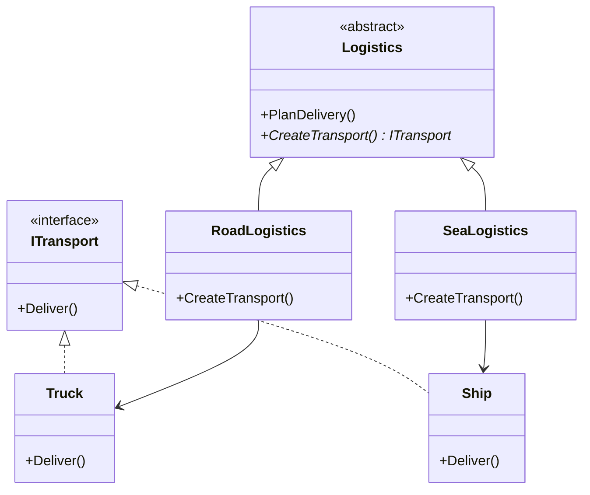

# Factory Method Pattern

## Problem

🏭  
Need to create objects without specifying exact classes:

- Anticipate multiple object variants
- Decouple client code from concrete implementations
- Allow future extensibility for new types
- Support multiple parallel hierarchies

## Solution

🛠️  
Define interface for object creation:

- **Product**: Common interface for created objects
- **Creator**: Declares factory method (abstract)
- **Concrete Creators**: Implement factory method for specific products

## Use Cases

🚚

- Cross-platform UI components
- Document format converters
- Payment gateway integrations
- Game character spawning
- Logistics management systems

## How to Implement (OOP Steps)

1️⃣ **Create Product Interface**

- Defines common operations
- _Type:_ Interface (`ITransport`)

2️⃣ **Implement Concrete Products**

- Variant-specific implementations
- _Type:_ Concrete classes (`Truck`, `Ship`)

3️⃣ **Declare Creator Abstract Class**

- Contains factory method (`CreateTransport()`)
- _Type:_ Abstract class (`Logistics`)

4️⃣ **Implement Concrete Creators**

- Override factory method for specific products
- _Type:_ Subclasses (`RoadLogistics`, `SeaLogistics`)

5️⃣ **Client Code**

- Works with creator/product interfaces
- _Type:_ Any class needing object creation

## Structure

⌨️



## C# Implementation

### Product Interface

```csharp
public interface ITransport
{
    void Deliver();
}
```

### Concrete Products

```csharp
public class Truck : ITransport
{
    public void Deliver()
    {
        Console.WriteLine("Delivering by road in a box truck");
    }
}

public class Ship : ITransport
{
    public void Deliver()
    {
        Console.WriteLine("Delivering by sea in a container ship");
    }
}
```

### Creator Abstract Class

```csharp
public abstract class Logistics
{
    // Factory method
    public abstract ITransport CreateTransport();

    public void PlanDelivery()
    {
        var transport = CreateTransport();
        Console.WriteLine("Planning delivery route...");
        transport.Deliver();
    }
}
```

### Concrete Creators

```csharp
public class RoadLogistics : Logistics
{
    public override ITransport CreateTransport()
    {
        return new Truck();
    }
}

public class SeaLogistics : Logistics
{
    public override ITransport CreateTransport()
    {
        return new Ship();
    }
}
```

## Usage

```csharp
Logistics logistics;

// Configure based on need
logistics = new RoadLogistics();
logistics.PlanDelivery();
// Output: Planning delivery route...
//         Delivering by road in a box truck

logistics = new SeaLogistics();
logistics.PlanDelivery();
// Output: Planning delivery route...
//         Delivering by sea in a container ship
```

## Key Points

🔑

- **Open/Closed Principle**: Add new products without changing client code
- **Single Responsibility**: Creation logic in separate classes
- **Loose Coupling**: Client depends on interfaces, not concretions
- **Hierarchy Support**: Parallel product/creator evolution

## Code Comments

- **ITransport**: Common delivery contract
- **Logistics**: Base creator with template method
- **CreateTransport()**: Factory method to override
- **PlanDelivery()**: Business logic using factory product

## Variations

- **Parameterized Factories**: Create based on input
- **Default Implementation**: Base product in abstract creator
- **Static Factory Methods**: For simple scenarios
- **Dependency Injection**: Combine with DI containers

## Anti-Pattern Warnings

⚠️

- Unnecessary complexity for simple object creation
- Class explosion with many product variants
- Overuse when direct instantiation suffices
