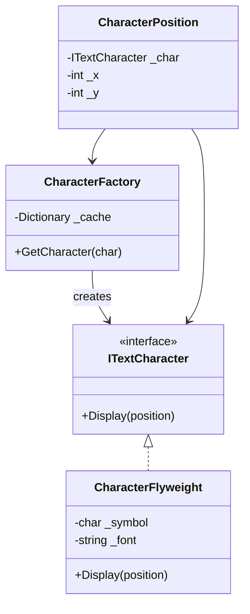

# Flyweight Pattern

## Problem

🐜  
Applications using massive quantities of objects face:

- High memory consumption
- Redundant data storage
- Performance degradation due to object proliferation

## Solution

🏋️  
Share common object state (intrinsic) across multiple objects:

- **Flyweight**: Stores shared intrinsic state
- **Context**: Contains unique extrinsic state
- **Factory**: Manages flyweight reuse

## Use Cases

📚

- Text formatting in word processors
- Game environments (trees, particles)
- GUI systems with repeated elements
- Network connection pools

## How to Implement (OOP Steps)

1️⃣ **Separate State**

- Identify intrinsic (shared) vs extrinsic (unique) state
- _Analysis Step_

2️⃣ **Create Flyweight Interface**

- Declares methods using extrinsic state
- _Type:_ Interface (`ITextCharacter`)

3️⃣ **Implement Concrete Flyweight**

- Stores intrinsic state
- _Type:_ Concrete class (`CharacterFlyweight`)

4️⃣ **Build Flyweight Factory**

- Caches/reuses existing flyweights
- _Type:_ Singleton factory class

5️⃣ **Client Code**

- Maintains extrinsic state
- _Type:_ Context objects (`CharacterPosition`)

## Structure

⌨️



## C# Implementation

### Flyweight Interface

```csharp
public interface ITextCharacter
{
    void Display(int x, int y);
}
```

### Concrete Flyweight

```csharp
public class CharacterFlyweight : ITextCharacter
{
    private readonly char _symbol;
    private readonly string _fontFamily;

    public CharacterFlyweight(char symbol, string font)
    {
        _symbol = symbol;
        _fontFamily = font;
    }

    public void Display(int x, int y)
    {
        Console.WriteLine($"Display '{_symbol}' in {_fontFamily} at ({x},{y})");
    }
}
```

### Flyweight Factory

```csharp
public class CharacterFactory
{
    private readonly Dictionary<char, ITextCharacter> _cache = new();

    public ITextCharacter GetCharacter(char symbol)
    {
        if (!_cache.ContainsKey(symbol))
        {
            // Intrinsic state: Shared across all instances
            _cache[symbol] = new CharacterFlyweight(
                symbol,
                "Arial" // Could be configurable
            );
        }
        return _cache[symbol];
    }
}
```

### Client Usage

```csharp
public class CharacterPosition
{
    private readonly ITextCharacter _character;
    private readonly int _x;
    private readonly int _y;

    public CharacterPosition(char c, int x, int y, CharacterFactory factory)
    {
        _character = factory.GetCharacter(c);
        _x = x;
        _y = y;
    }

    public void Display()
    {
        _character.Display(_x, _y);
    }
}
```

## Usage

```csharp
var factory = new CharacterFactory();
var document = new List<CharacterPosition>
{
    new('A', 0, 0, factory),
    new('B', 1, 0, factory),
    new('A', 0, 1, factory)
};

foreach (var pos in document)
{
    pos.Display();
}

/* Output:
Display 'A' in Arial at (0,0)
Display 'B' in Arial at (1,0)
Display 'A' in Arial at (0,1)
*/
```

## Key Points

🔑

- **Memory Efficiency**: Shares common state
- **State Separation**: Intrinsic vs extrinsic
- **Centralized Management**: Factory controls instantiation
- **Immutable Flyweights**: Shared state cannot change

## Code Comments

- **ITextCharacter**: Defines display contract
- **CharacterFlyweight**: Stores char/font (intrinsic)
- **CharacterFactory**: Ensures character reuse
- **CharacterPosition**: Manages position (extrinsic)

## Variations

- **Multiton Pattern**: For different flyweight groups
- **Composite Flyweights**: Combine simple flyweights
- **Lazy Initialization**: Create on first use
- **Thread-Safe Factory**: For concurrent access
