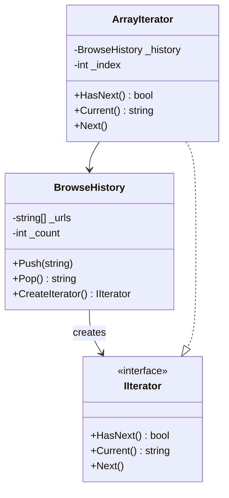

# Iterator Pattern

## Problem

📦  
Need to traverse collection elements without exposing internal structure. Different data structures (arrays, lists, trees) require different traversal mechanisms, leading to complex client code.

## Solution

🔄  
The Iterator Pattern:

- Provides sequential access to elements
- Encapsulates traversal logic
- Maintains collection encapsulation

Components:

- **Iterator**: Interface defining traversal operations (`IIterator`)
- **Concrete Iterator**: Implementation for specific collection (`ArrayIterator`)
- **Aggregate**: Collection object that creates iterators (`BrowseHistory`)

## Use Cases

🔍

- Navigating different collection types
- Unified iteration interface
- Lazy/efficient element access
- Parallel iteration support

## How to Implement (OOP Steps)

1️⃣ **Create Iterator Interface**

- Declares `HasNext`, `Current`, `Next`
- _Type:_ Interface (`IIterator<T>`)

2️⃣ **Implement Aggregate Interface**

- Declares `CreateIterator()` method
- _Type:_ Interface (`ICollection<T>`)

3️⃣ **Build Concrete Iterator**

- Contains traversal logic for specific collection
- _Type:_ Nested class (usually private)

## Structure

⌨️



## C# Implementation

### IIterator (Interface)

```csharp
public interface IIterator
{
    bool HasNext();
    string Current();
    void Next();
}
```

### BrowseHistory (Aggregate)

```csharp
public class BrowseHistory
{
    private string[] _urls = new string[10];
    private int _count;

    public void Push(string url)
    {
        if (_count < _urls.Length)
            _urls[_count++] = url;
    }

    public string Pop()
    {
        return _count > 0 ? _urls[--_count] : null;
    }

    public IIterator CreateIterator()
    {
        return new ArrayIterator(this);
    }

    // Nested iterator implementation
    private class ArrayIterator : IIterator
    {
        private readonly BrowseHistory _history;
        private int _index;

        public ArrayIterator(BrowseHistory history)
        {
            _history = history;
        }

        public bool HasNext()
        {
            return _index < _history._count;
        }

        public string Current()
        {
            return _history._urls[_index];
        }

        public void Next()
        {
            if (HasNext())
                _index++;
        }
    }
}
```

## Usage

```csharp
var history = new BrowseHistory();
history.Push("https://example.com");
history.Push("https://google.com");

var iterator = history.CreateIterator();
while (iterator.HasNext())
{
    Console.WriteLine(iterator.Current());
    iterator.Next();
}
// Output:
// https://example.com
// https://google.com
```

## Key Points

🔑

- **Encapsulation**: Collection internals remain private
- **SRP**: Traversal logic separated from collection
- **Multiple Iterators**: Support simultaneous independent iterations
- **Polymorphic Iteration**: Same interface for different collections

## Code Comments

- **BrowseHistory**: Maintains URL stack, creates type-specific iterator
- **ArrayIterator**: Knows array-based traversal logic
- **IIterator**: Standardizes iteration contract
- **Nested Class**: Iterator implementation hidden from clients
