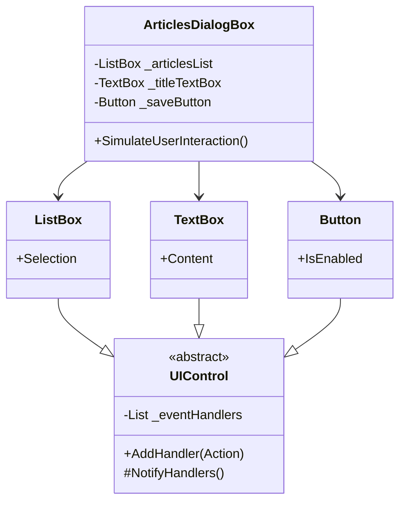

# Mediator Pattern

## Problem

🗣️  
Multiple UI components need to interact (ListBox ↔ TextBox ↔ Button) creating complex dependencies. Direct communication leads to:

- Tight coupling
- Hard-to-maintain code
- Difficult component reuse

## Solution

📱  
Introduce a mediator that:

- Acts as communication hub
- Encapsulates interaction rules
- Reduces component dependencies

Components:

- **Mediator**: Coordinates interactions (`ArticlesDialogBox`)
- **Colleagues**: Independent components (`ListBox`, `Button`)
- **EventHandler**: Notification contract

## Use Cases

🖥️

- Complex dialog boxes
- Multi-component forms
- Chat applications
- Air traffic control systems

## How to Implement (OOP Steps)

1️⃣ **Define Mediator Interface**

- Declares component communication methods
- _Type:_ Interface (`IMediator`)

2️⃣ **Create Colleague Base Class**

- Contains mediator reference
- _Type:_ Abstract class

3️⃣ **Implement Concrete Mediator**

- Contains all component references
- Implements interaction logic
- _Type:_ Concrete class

## Structure

⌨️



## C# Implementation

### Event Handler (Using C# Actions)

```csharp
public abstract class UIControl
{
    private readonly List<Action> _eventHandlers = new();

    public void AddHandler(Action handler)
    {
        _eventHandlers.Add(handler);
    }

    protected void NotifyHandlers()
    {
        foreach (var handler in _eventHandlers)
        {
            handler.Invoke();
        }
    }
}
```

### Colleague Classes

```csharp
public class ListBox : UIControl
{
    private string _selection;

    public string Selection
    {
        get => _selection;
        set
        {
            _selection = value;
            NotifyHandlers();
        }
    }
}

public class TextBox : UIControl
{
    private string _content;

    public string Content
    {
        get => _content;
        set
        {
            _content = value;
            NotifyHandlers();
        }
    }
}

public class Button : UIControl
{
    private bool _isEnabled;

    public bool IsEnabled
    {
        get => _isEnabled;
        set
        {
            _isEnabled = value;
            NotifyHandlers();
        }
    }
}
```

### Mediator

```csharp
public class ArticlesDialogBox
{
    private readonly ListBox _articlesList = new();
    private readonly TextBox _titleTextBox = new();
    private readonly Button _saveButton = new();

    public ArticlesDialogBox()
    {
        _articlesList.AddHandler(ArticleSelected);
        _titleTextBox.AddHandler(TitleChanged);
    }

    public void SimulateUserInteraction()
    {
        _articlesList.Selection = "Article 1";
        _titleTextBox.Content = "";
        _titleTextBox.Content = "Article 2";
        Console.WriteLine($"Text Box: {_titleTextBox.Content}");
        Console.WriteLine($"Save Button: {_saveButton.IsEnabled}");
    }

    private void TitleChanged()
    {
        _saveButton.IsEnabled = !string.IsNullOrEmpty(_titleTextBox.Content);
    }

    private void ArticleSelected()
    {
        _titleTextBox.Content = _articlesList.Selection;
        _saveButton.IsEnabled = true;
    }
}
```

## Usage

```csharp
var dialog = new ArticlesDialogBox();
dialog.SimulateUserInteraction();

/* Output:
Text Box: Article 2
Save Button: True
*/
```

## Key Points

🔑

- **Decoupled Components**: UI elements don't reference each other
- **Centralized Logic**: Interaction rules in one place
- **Reusable Colleagues**: ListBox/TextBox can be used elsewhere
- **Event-Driven**: Components notify without knowing recipients

## Code Comments

- **UIControl**: Base class for event management
- **AddHandler**: Uses C# Action for event subscription
- **NotifyHandlers**: Generic notification mechanism
- **Mediator Methods**: Contain all interaction logic (ArticleSelected/TitleChanged)

## Variations

- **Component Interfaces**: Strongly-typed event handlers
- **Event Payloads**: Pass contextual data with notifications
- **Multiple Mediators**: For complex systems with subsystems
