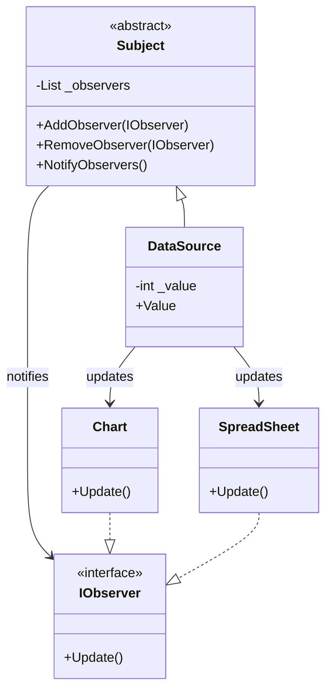

# Observer Pattern

## Problem

🔍  
Need to establish a one-to-many dependency between objects, where state changes in one object (subject) automatically notify and update multiple dependent objects (observers). Avoid tight coupling between subject and observers.

## Solution

📡  
The Observer Pattern:

- Defines a subscription mechanism
- Notifies multiple objects automatically
- Maintains loose coupling through interfaces

Components:

- **Subject**: Maintains observer list and sends notifications
- **Observer**: Interface for update notifications
- **Concrete Subject**: State container that triggers notifications
- **Concrete Observers**: Perform actions on notifications

## Use Cases

📊

- Stock market monitoring
- Event handling systems
- UI data-binding
- Distributed notification services
- Sensor monitoring systems

## How to Implement (OOP Steps)

1️⃣ **Create Subject Interface**

- `Register`, `Remove`, `Notify` methods
- _Type:_ Abstract class/interface

2️⃣ **Define Observer Interface**

- `Update()` method
- _Type:_ Interface (`IObserver`)

3️⃣ **Implement Concrete Subject**

- Maintains state and observer list
- _Type:_ Concrete class

4️⃣ **Build Concrete Observers**

- Implement update logic
- _Type:_ Concrete classes

## Structure

⌨️



## C# Implementation

### Observer Interface

```csharp
public interface IObserver
{
    void Update();
}
```

### Subject (Observable)

```csharp
public abstract class Subject
{
    private readonly List<IObserver> _observers = new();

    public void AddObserver(IObserver observer)
    {
        _observers.Add(observer);
    }

    public void RemoveObserver(IObserver observer)
    {
        _observers.Remove(observer);
    }

    protected void NotifyObservers()
    {
        foreach (var observer in _observers)
        {
            observer.Update();
        }
    }
}
```

### Concrete Subject

```csharp
public class DataSource : Subject
{
    private int _value;

    // Property triggers notifications on set
    public int Value
    {
        get => _value;
        set
        {
            _value = value;
            NotifyObservers();
        }
    }
}
```

### Concrete Observers

```csharp
public class Chart : IObserver
{
    private readonly DataSource _dataSource;

    public Chart(DataSource dataSource)
    {
        _dataSource = dataSource;
    }

    public void Update()
    {
        Console.WriteLine($"Chart updated: {_dataSource.Value}");
    }
}

public class SpreadSheet : IObserver
{
    private readonly DataSource _dataSource;

    public SpreadSheet(DataSource dataSource)
    {
        _dataSource = dataSource;
    }

    public void Update()
    {
        Console.WriteLine($"Spreadsheet notified: {_dataSource.Value}");
    }
}
```

## Usage

```csharp
var dataSource = new DataSource();

// Create observers
var chart = new Chart(dataSource);
var sheet = new SpreadSheet(dataSource);

// Register observers
dataSource.AddObserver(chart);
dataSource.AddObserver(sheet);

// Change value (triggers notifications)
dataSource.Value = 42;

/* Output:
Chart updated: 42
Spreadsheet notified: 42
*/
```

## Key Points

🔑

- **Loose Coupling**: Subjects don't know observer details
- **Dynamic Relationships**: Observers can be added/removed at runtime
- **Broadcast Communication**: One change notifies multiple observers
- **Performance Considerations**: Be mindful with large numbers of observers

## Code Comments

- **Subject**: Base class managing observer registration/notification
- **DataSource**: Value container that auto-notifies on changes
- **Chart/SpreadSheet**: Concrete observers with update logic
- **IObserver**: Standardized notification contract

## Variations

- **Push Model**: Pass changed data directly in Update() method
- **Event Handlers**: Use C# events/delegates as alternative
- **Weak References**: Prevent memory leaks in long-lived subjects
