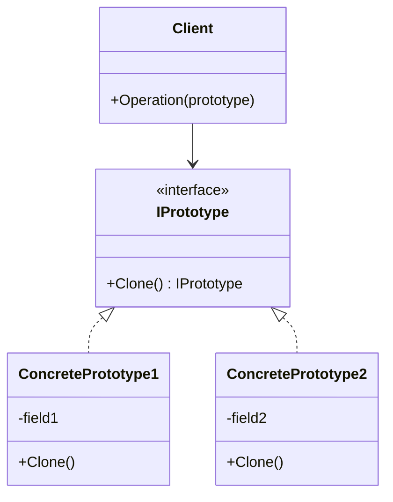

# Prototype Pattern

## Problem

🎭  
Need to create new objects by copying existing instances when:

- Object creation is expensive (database calls, complex computations)
- Classes are unavailable at compile time (dynamic loading)
- Objects have numerous configuration options
- System should be independent of how products are created

## Solution

📋  
Create cloneable prototypes that:

- Implement a cloning interface/method
- Produce independent copies of themselves
- Avoid complex initialization code repetition

## Use Cases

🧬

- Game development (character templates)
- Document template systems
- Machine learning model configurations
- Undo/redo functionality via state snapshots

## How to Implement (OOP Steps)

1️⃣ **Define Prototype Interface**

- Declares `Clone()` method
- _Type:_ Interface (`ICloneable` or custom `IPrototype`)

2️⃣ **Implement Concrete Prototypes**

- Override cloning method for deep/shallow copies
- _Type:_ Concrete classes

3️⃣ **Create Prototype Registry (Optional)**

- Stores pre-configured prototypes
- _Type:_ Dictionary/Factory class

4️⃣ **Client Code**

- Creates new objects via cloning instead of `new`
- _Type:_ Any class needing object copies

## Structure

⌨️



## C# Implementation

### Prototype Interface

```csharp
public interface IPrototype
{
    IPrototype Clone();
}
```

### Concrete Prototype

```csharp
public class Person : IPrototype
{
    public string Name;
    public Address Address;

    public IPrototype Clone()
    {
        // Shallow copy
        var clone = (Person)this.MemberwiseClone();

        // Deep copy for reference types
        clone.Address = new Address(Address.Street);

        return clone;
    }
}

public class Address
{
    public string Street;

    public Address(string street)
    {
        Street = street;
    }
}
```

### Prototype Registry

```csharp
public class PrototypeRegistry
{
    private static Dictionary<string, IPrototype> _prototypes = new();

    public static void AddPrototype(string key, IPrototype prototype)
    {
        _prototypes[key] = prototype;
    }

    public static IPrototype GetClone(string key)
    {
        return _prototypes[key].Clone();
    }
}
```

## Usage

```csharp
var original = new Person
{
    Name = "John",
    Address = new Address("123 Main St")
};

var clone = (Person)original.Clone();
clone.Name = "Jane";
clone.Address.Street = "456 Oak Ave";

Console.WriteLine(original.Address.Street);  // 123 Main St
Console.WriteLine(clone.Address.Street);     // 456 Oak Ave
```

## Key Points

🔑

- **Avoids Costly Initialization**: Reuses existing object states
- **Deep vs Shallow**: Control copy depth based on needs
- **Prototype Registry**: Preconfigured templates
- **Dynamic Configuration**: Runtime object customization

## Code Comments

- **IPrototype**: Base cloning contract
- **MemberwiseClone()**: Built-in shallow copy mechanism
- **Address**: Reference type requiring deep copy
- **PrototypeRegistry**: Central prototype management

## Variations

- **Abstract Prototypes**: Base class with cloning logic
- **Serialization-Based Cloning**: For complex object graphs
- **Copy Constructors**: Alternative cloning mechanism
- **Lazy Cloning**: Delay full copy until needed
