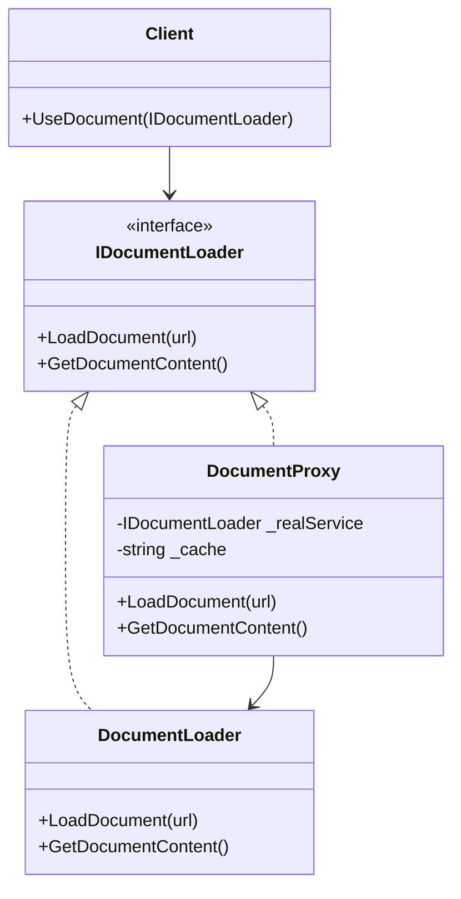

# Proxy Pattern

## Problem

🛡️  
Need to control access to an object for:

- Lazy initialization of expensive resources
- Access control/validation
- Logging and monitoring
- Remote object communication
- Caching of sensitive operations

## Solution

🎭  
Provide a surrogate object that:

- Implements the same interface as real object
- Controls access to real object
- Adds pre/post processing layer

## Use Cases

🔐

- API rate limiting
- Virtual document loading
- Permission checks
- Database connection pooling
- Smart reference counting

## How to Implement (OOP Steps)

1️⃣ **Define Subject Interface**

- Common operations for real/proxy objects
- _Type:_ Interface (`IDocumentLoader`)

2️⃣ **Create Real Subject**

- Implements core business logic
- _Type:_ Concrete class (`DocumentLoader`)

3️⃣ **Implement Proxy Class**

- Maintains reference to real subject
- _Type:_ Concrete class (`DocumentProxy`)

4️⃣ **Add Control Logic**

- Implement caching/access checks/lazy init
- _Type:_ Conditional logic in proxy methods

## Structure

⌨️



## C# Implementation

### Subject Interface

```csharp
public interface IDocumentLoader
{
    void LoadDocument(string url);
    string GetDocumentContent();
}
```

### Real Subject

```csharp
public class DocumentLoader : IDocumentLoader
{
    private string _content;

    public void LoadDocument(string url)
    {
        Console.WriteLine($"Downloading document from {url}");
        // Simulate expensive operation
        Thread.Sleep(2000);
        _content = "Document content";
    }

    public string GetDocumentContent() => _content;
}
```

### Proxy Class

```csharp
public class DocumentProxy : IDocumentLoader
{
    private DocumentLoader _realService;
    private string _cache;
    private readonly List<string> _allowedUrls = new() { "trusted.com", "safe.org" };

    public void LoadDocument(string url)
    {
        if (!_allowedUrls.Contains(new Uri(url).Host))
            throw new UnauthorizedAccessException("Domain blocked");

        if (_realService == null)
        {
            _realService = new DocumentLoader();
        }

        if (string.IsNullOrEmpty(_cache))
        {
            _realService.LoadDocument(url);
            _cache = _realService.GetDocumentContent();
        }
    }

    public string GetDocumentContent()
    {
        return _cache ?? throw new InvalidOperationException("Document not loaded");
    }
}
```

## Usage

```csharp
var proxy = new DocumentProxy();

try
{
    // Attempt to load blocked domain
    proxy.LoadDocument("https://malicious.com/doc");
}
catch (Exception ex)
{
    Console.WriteLine(ex.Message); // "Domain blocked"
}

// Load valid document
proxy.LoadDocument("https://trusted.com/report.pdf");
Console.WriteLine(proxy.GetDocumentContent()); // "Document content"

// Subsequent call uses cache
proxy.LoadDocument("https://trusted.com/report.pdf"); // No download occurs
```

## Key Points

🔑

- **Lazy Initialization**: Real object created only when needed
- **Access Control**: Proxy validates requests first
- **Caching**: Avoids repeated expensive operations
- **Transparency**: Client interacts with interface

## Code Comments

- **IDocumentLoader**: Common document operations contract
- **DocumentLoader**: Actual network/download logic
- **DocumentProxy**: Adds security + caching layer
- **\_allowedUrls**: Whitelist for domain validation

## Variations

- **Virtual Proxy**: Delays expensive object creation
- **Protection Proxy**: Implements access control
- **Remote Proxy**: Handles network communication
- **Smart Proxy**: Reference counting/logging
