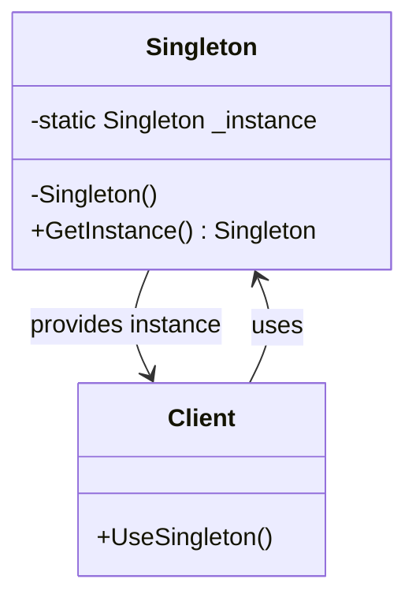

# Singleton Pattern

## Problem

👤  
Need to ensure a class has **only one instance** while providing global access when:

- Shared resources must be controlled (database connections)
- Global configuration settings
- Centralized logging or caching
- Preventing multiple instantiations of expensive objects

## Solution

🔒  
Restrict class instantiation by:

- Making constructor private
- Creating static instance accessor
- Controlling initialization timing (eager/lazy)

## Use Cases

🌐

- Configuration managers
- Connection pools
- Device drivers
- Logger systems
- Service locators

## How to Implement (OOP Steps)

1️⃣ **Private Constructor**

- Prevent external instantiation
- _Modifier:_ `private`

2️⃣ **Static Instance Field**

- Holds single instance reference
- _Type:_ `static` class member

3️⃣ **Public Access Method**

- Controls instance creation/access
- _Type:_ `static` method/property

4️⃣ **Thread Safety (Optional)**

- Use locking/Lazy<T> for multi-threaded environments
- _Mechanism:_ `lock` statement or `Lazy<T>` wrapper

## Structure

⌨️



## C# Implementation

### Thread-Safe Lazy Initialization (Best Practice)

```csharp
public sealed class Singleton
{
    // Lazy<T> ensures thread-safe initialization
    private static readonly Lazy<Singleton> _instance =
        new Lazy<Singleton>(() => new Singleton());

    // Public access point
    public static Singleton Instance => _instance.Value;

    // Private constructor
    private Singleton()
    {
        // Initialization code
    }

    // Example method
    public void Log(string message)
    {
        Console.WriteLine($"[LOG] {DateTime.UtcNow}: {message}");
    }
}
```

## Usage

```csharp
// Access singleton instance
Singleton.Instance.Log("Application started");

// Attempting to create new instance will cause compile error
// var illegal = new Singleton(); // Not allowed

// All references point to same instance
var config1 = Singleton.Instance;
var config2 = Singleton.Instance;
Console.WriteLine(ReferenceEquals(config1, config2)); // True
```

## Key Points

🔑

- **Single Instance**: Guaranteed by private constructor
- **Global Access**: Via static property/method
- **Thread Safety**: Critical for multi-threaded apps
- **Lazy Initialization**: Optimizes resource usage
- **Sealed Class**: Prevents inheritance/subclassing

## Code Comments

- **Lazy<T>**: .NET's built-in thread-safe initialization
- **sealed**: Blocks inheritance
- **static**: Class-level instance management
- **Value**: Actual singleton instance accessor

## Variations

- **Eager Initialization**: Instantiate at class load
- **Double-Check Locking**: Legacy thread-safe approach
- **Singleton Registry**: Manage multiple singletons
- **Monostate**: Share state through static members

## Anti-Pattern Warnings

⚠️

- Overuse leads to tight coupling
- Difficult to unit test
- Potential hidden dependencies
- Not thread-safe by default (requires explicit handling)
