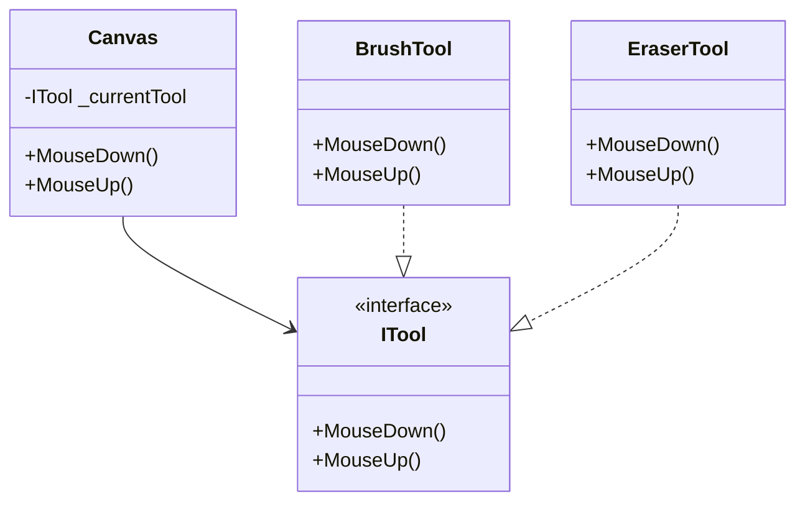

# State Pattern

## Problem

🎨  
Objects need to change behavior based on internal state, leading to complex conditional logic. Example: Graphic tools with different mouse interactions for brushes/erasers.

## Solution

🛠  
The State Pattern:

- Encapsulates state-specific behavior in separate classes
- Delegates state-dependent actions to current state object
- Makes state transitions explicit

Components:

- **Context**: Object with changing behavior (`Canvas`)
- **State Interface**: Common interface for states (`ITool`)
- **Concrete States**: State implementations (`BrushTool`, `EraserTool`)

## Use Cases

🔧

- Drawing applications
- Game character behavior
- Document editing modes
- Network connection states

## Structure

⌨️



## C# Implementation

### ITool (State Interface)

```csharp
public interface ITool
{
    void MouseDown();
    void MouseUp();
}
```

### Canvas (Context)

```csharp
public class Canvas
{
    private ITool _currentTool;

    // Delegates mouse events to current tool
    public void MouseDown() => _currentTool?.MouseDown();
    public void MouseUp() => _currentTool?.MouseUp();

    public ITool CurrentTool
    {
        get => _currentTool;
        set => _currentTool = value;
    }
}
```

### BrushTool (Concrete State)

```csharp
public class BrushTool : ITool
{
    public void MouseDown()
    {
        Console.WriteLine("Display brush cursor");
    }

    public void MouseUp()
    {
        Console.WriteLine("Draw smooth stroke on canvas");
    }
}
```

### EraserTool (Concrete State)

```csharp
public class EraserTool : ITool
{
    public void MouseDown()
    {
        Console.WriteLine("Show eraser preview");
    }

    public void MouseUp()
    {
        Console.WriteLine("Remove drawn content");
    }
}
```

## Usage

```csharp
var canvas = new Canvas();

// Activate brush tool
canvas.CurrentTool = new BrushTool();
canvas.MouseDown(); // Output: "Display brush cursor"
canvas.MouseUp();   // Output: "Draw smooth stroke on canvas"

// Switch to eraser tool
canvas.CurrentTool = new EraserTool();
canvas.MouseDown(); // Output: "Show eraser preview"
canvas.MouseUp();   // Output: "Remove drawn content"
```

## Key Points

🔑

- **Eliminates Conditionals**: No switch/if-else for different states
- **Single Responsibility**: Each state handles its own logic
- **Open/Closed Principle**: Add new states without changing context
- **Explicit Transitions**: State changes are visible and controlled

## Code Comments

- **Canvas**: Maintains current tool state without knowing implementation details
- **ITool**: Contract for all tool behaviors
- **Concrete Tools**: Encapsulate state-specific interaction logic
