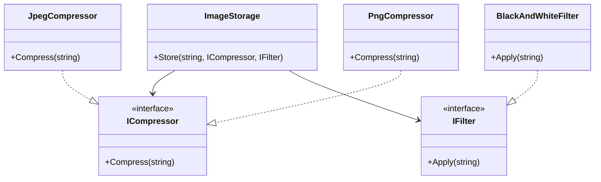

# Strategy Pattern

## Problem

🖼️  
Need to dynamically switch between different algorithms (e.g., compression formats, image filters) while avoiding:

- Rigid conditional statements
- Code duplication
- Tight coupling between algorithm and context

## Solution

🎯  
The Strategy Pattern:

- Encapsulates algorithms into interchangeable objects
- Enables runtime algorithm selection
- Promotes open/closed principle

Components:

- **Context**: Class using strategies (`ImageStorage`)
- **Strategy Interfaces**: Contracts for algorithms (`ICompressor`, `IFilter`)
- **Concrete Strategies**: Algorithm implementations (`JpegCompressor`, `BlackAndWhiteFilter`)

## Use Cases

📸

- Image processing pipelines
- Payment method processing
- Data encryption methods
- Sorting algorithm selection

## How to Implement (OOP Steps)

1️⃣ **Define Strategy Interface**

- Declares algorithm method(s)
- _Type:_ Interface (`IStrategy`)

2️⃣ **Implement Concrete Strategies**

- Separate class per algorithm variation
- _Type:_ Concrete classes

3️⃣ **Create Context Class**

- Accepts strategy via constructor/property
- Delegates work to strategy object
- _Type:_ Concrete class

## Structure

⌨️



## C# Implementation

### Strategy Interfaces

```csharp
public interface ICompressor
{
    void Compress(string fileName);
}

public interface IFilter
{
    void Apply(string fileName);
}
```

### Context (ImageStorage)

```csharp
public class ImageStorage
{
    public void Store(string fileName, ICompressor compressor, IFilter filter)
    {
        compressor.Compress(fileName);
        filter.Apply(fileName);
    }
}
```

### Concrete Strategies

```csharp
public class JpegCompressor : ICompressor
{
    public void Compress(string fileName)
    {
        Console.WriteLine("Applying JPEG compression");
    }
}

public class PngCompressor : ICompressor
{
    public void Compress(string fileName)
    {
        Console.WriteLine("Applying PNG compression");
    }
}

public class BlackAndWhiteFilter : IFilter
{
    public void Apply(string fileName)
    {
        Console.WriteLine("Applying black and white filter");
    }
}
```

## Usage

```csharp
var storage = new ImageStorage();

// Store with JPEG + B&W
storage.Store("photo1",
    new JpegCompressor(),
    new BlackAndWhiteFilter());

// Store with PNG + No filter (create NullFilter if needed)
storage.Store("photo2",
    new PngCompressor(),
    new NullFilter()); // Example extension

/* Output:
Applying JPEG compression
Applying black and white filter
Applying PNG compression
*/
```

## Key Points

🔑

- **Decoupling**: Algorithms separated from consumer
- **Composability**: Combine strategies freely (e.g., PNG + B&W)
- **Testability**: Strategies can be tested in isolation
- **Extensibility**: Add new strategies without modifying context

## Code Comments

- **ImageStorage**: Knows _how to use_ strategies but not _how they work_
- **ICompressor/IFilter**: Pure behavior contracts
- **Concrete Strategies**: No state - focused on single responsibility
- **Null Filter**: Optional pattern for no-op implementations
