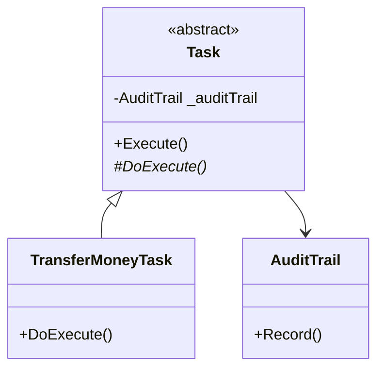

# Template Method Pattern

## Problem

📋  
Need to define a common algorithm structure while allowing subclasses to override specific steps. Avoid duplicate code in related classes sharing similar workflows.

## Solution

📐  
The Template Method Pattern:

- Defines algorithm skeleton in base class
- Allows subclasses to override optional steps
- Maintains workflow sequence
- Promotes code reuse through inheritance

Components:

- **Abstract Class**: Defines template method (`Task`)
- **Concrete Class**: Implements abstract steps (`TransferMoneyTask`)
- **Helper Component**: Reusable utilities (`AuditTrail`)

## Use Cases

🛠

- Workflow engines
- Data processing pipelines
- Framework hooks
- Standardized reporting

## How to Implement (OOP Steps)

1️⃣ **Create Abstract Base Class**

- Defines template method (`final`)
- Declares abstract primitive operations
- _Type:_ Abstract class

2️⃣ **Implement Hook Methods**

- Optional virtual methods with default impl
- _Type:_ Virtual methods

3️⃣ **Build Concrete Subclasses**

- Override abstract/hook methods
- _Type:_ Concrete classes

## Structure

⌨️



## C# Implementation

### AuditTrail (Helper)

```csharp
public class AuditTrail
{
    public void Record()
    {
        Console.WriteLine("Audit recorded");
    }
}
```

### Abstract Task

```csharp
public abstract class Task
{
    private readonly AuditTrail _auditTrail;

    // Default constructor for internal audit
    protected Task()
    {
        _auditTrail = new AuditTrail();
    }

    // Constructor for dependency injection
    protected Task(AuditTrail auditTrail)
    {
        _auditTrail = auditTrail;
    }

    // Template method (final to prevent overriding)
    public void Execute()
    {
        _auditTrail.Record();
        DoExecute();
    }

    // Primitive operation to be overridden
    protected abstract void DoExecute();
}
```

### Concrete Task

```csharp
public class TransferMoneyTask : Task
{
    public TransferMoneyTask() : base() { }
    public TransferMoneyTask(AuditTrail audit) : base(audit) { }

    protected override void DoExecute()
    {
        Console.WriteLine("Money transferred");
    }
}
```

## Usage

```csharp
// With default audit
var task1 = new TransferMoneyTask();
task1.Execute();

// With shared audit trail
var audit = new AuditTrail();
var task2 = new TransferMoneyTask(audit);
task2.Execute();

/* Output:
Audit recorded
Money transferred
Audit recorded
Money transferred
*/
```

## Key Points

🔑

- **Inversion of Control**: Parent class controls workflow
- **Mandatory Steps**: Base class ensures audit always runs
- **Flexible Initialization**: Dual constructors for DI
- **Protected Variations**: Changes affect only specific steps

## Code Comments

- **Task**: Base class enforces workflow through sealed Execute()
- **DoExecute**: Protected abstract method for subclass customization
- **AuditTrail**: Centralized logging component
- **Constructors**: Demonstrate both default and DI approaches

## Variations

- **Hooks**: Add optional virtual methods for additional extension points
- **NVI (Non-Virtual Interface)**: Public non-virtual template method calling protected virtuals
