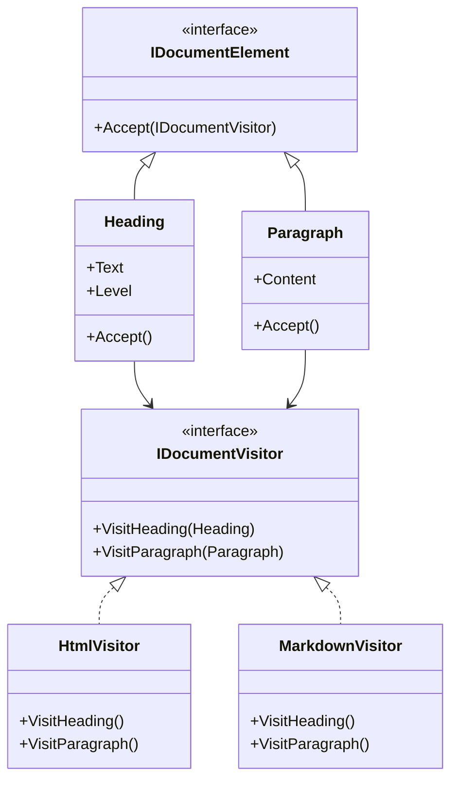

# Visitor Pattern

## Problem

📄  
Need to add new operations to complex object structures without changing their classes. Common when:

- You have stable element hierarchy
- Operations change frequently
- Operations need element-specific handling

## Solution

👥  
Separate algorithms from objects by:

- Defining operations in external visitor classes
- Dispatching calls through `Accept` methods
- Using double dispatch technique

## Use Cases

🔧

- Document format converters
- Code analysis tools
- Game object behaviors
- Tax calculation systems
- UI rendering engines

## How to Implement (OOP Steps)

1️⃣ **Define Element Interface (interface)**  
 Add `Accept(IVisitor)` method to all elements

2️⃣ **Create Visitor Interface**  
 Declare `Visit` methods for each element type

3️⃣ **Implement Elements**  
 Each element implements `Accept` to call visitor's method

4️⃣ **Create Concrete Visitors**  
 Implement operations by handling each element type

5️⃣ **Traverse Structure**  
 Pass visitor through object structure

## Structure

⌨️



## C# Implementation

### Element Interface

```csharp
public interface IDocumentElement
{
    void Accept(IDocumentVisitor visitor);
}
```

### Visitor Interface

```csharp
public interface IDocumentVisitor
{
    void VisitHeading(Heading heading);
    void VisitParagraph(Paragraph paragraph);
}
```

### Concrete Elements

```csharp
public class Heading : IDocumentElement
{
    public string Text { get; set; }
    public int Level { get; set; }

    public void Accept(IDocumentVisitor visitor)
    {
        visitor.VisitHeading(this);
    }
}

public class Paragraph : IDocumentElement
{
    public string Content { get; set; }

    public void Accept(IDocumentVisitor visitor)
    {
        visitor.VisitParagraph(this);
    }
}
```

### Concrete Visitors

```csharp
public class HtmlVisitor : IDocumentVisitor
{
    public string Output { get; private set; } = string.Empty;

    public void VisitHeading(Heading heading)
    {
        Output += $"<h{heading.Level}>{heading.Text}</h{heading.Level}>\n";
    }

    public void VisitParagraph(Paragraph paragraph)
    {
        Output += $"<p>{paragraph.Content}</p>\n";
    }
}

public class MarkdownVisitor : IDocumentVisitor
{
    public string Output { get; private set; } = string.Empty;

    public void VisitHeading(Heading heading)
    {
        Output += $"{new string('#', heading.Level)} {heading.Text}\n\n";
    }

    public void VisitParagraph(Paragraph paragraph)
    {
        Output += $"{paragraph.Content}\n\n";
    }
}
```

### Document Structure

```csharp
public class Document
{
    private readonly List<IDocumentElement> _elements = new();

    public void AddElement(IDocumentElement element)
    {
        _elements.Add(element);
    }

    public void Accept(IDocumentVisitor visitor)
    {
        foreach (var element in _elements)
        {
            element.Accept(visitor);
        }
    }
}
```

## Usage

```csharp
var document = new Document();
document.AddElement(new Heading { Text = "Welcome", Level = 1 });
document.AddElement(new Paragraph { Content = "This is visitor pattern" });

// Export to HTML
var htmlVisitor = new HtmlVisitor();
document.Accept(htmlVisitor);
Console.WriteLine(htmlVisitor.Output);

// Export to Markdown
var mdVisitor = new MarkdownVisitor();
document.Accept(mdVisitor);
Console.WriteLine(mdVisitor.Output);

/* HTML Output:
<h1>Welcome</h1>
<p>This is visitor pattern</p>

Markdown Output:
# Welcome

This is visitor pattern
*/
```

## Key Points

🔑

- **Separation of Concerns**: Operations live outside elements
- **Open/Closed Principle**: New visitors without changing elements
- **Double Dispatch**: Runtime type checking via method overloading
- **Structure Traversal**: Visitor handles iteration logic

## When to Use

✅

- Many unrelated operations on object structure
- Element classes are stable but operations change often
- Need to separate business logic from domain models

## Code Comments

- **Accept()**: Entry point for visitor operations
- **Visit Methods**: Handle element-specific logic
- **Output**: Visitor maintains operation state
- **Document**: Manages element collection traversal

## Common Pitfalls

⚠️

- Breaking encapsulation if visitors need internal state
- Complex setup for simple operations
- Difficulty adding new element types
