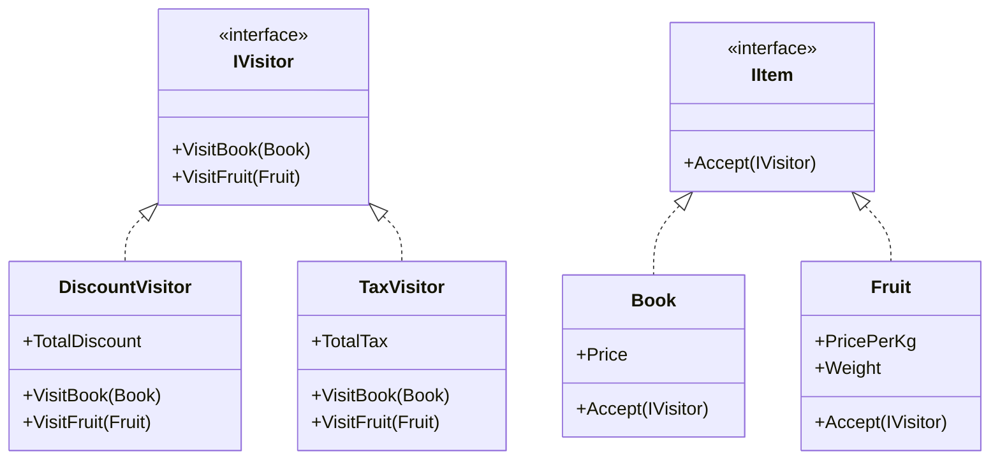

# Visitor Pattern

## Problem

🛒  
Need to add new operations to complex object structures (e.g., shopping cart items) without:

- Modifying existing classes
- Creating tight coupling
- Using type-checking conditionals

## Solution

👥  
The Visitor Pattern:

- Separates algorithms from objects
- Uses double dispatch
- Enables adding operations to object structures

Components:

- **Visitor Interface**: Operation contracts
- **Concrete Visitor**: Implements operations
- **Element Interface**: Accepts visitors
- **Concrete Elements**: Object structure components

## Use Cases

📊

- Document format conversions
- Shopping cart calculations
- Code analysis tools
- Game entity behaviors
- Report generators

## Structure

⌨️



## C# Implementation

### Element Interface

```csharp
public interface IItem
{
    void Accept(IVisitor visitor);
}
```

### Visitor Interface

```csharp
public interface IVisitor
{
    void VisitBook(Book book);
    void VisitFruit(Fruit fruit);
}
```

### Concrete Elements

```csharp
public class Book : IItem
{
    public decimal Price { get; set; }

    public void Accept(IVisitor visitor)
    {
        visitor.VisitBook(this);
    }
}

public class Fruit : IItem
{
    public decimal PricePerKg { get; set; }
    public decimal Weight { get; set; }

    public void Accept(IVisitor visitor)
    {
        visitor.VisitFruit(this);
    }
}
```

### Concrete Visitors

```csharp
public class DiscountVisitor : IVisitor
{
    public decimal TotalDiscount { get; private set; }

    public void VisitBook(Book book)
    {
        // 10% discount on books
        TotalDiscount += book.Price * 0.1m;
    }

    public void VisitFruit(Fruit fruit)
    {
        // 5% discount on fruits
        decimal total = fruit.PricePerKg * fruit.Weight;
        TotalDiscount += total * 0.05m;
    }
}

public class TaxVisitor : IVisitor
{
    public decimal TotalTax { get; private set; }

    public void VisitBook(Book book)
    {
        // 0% tax on books
        TotalTax += 0;
    }

    public void VisitFruit(Fruit fruit)
    {
        // 8% tax on fruits
        decimal total = fruit.PricePerKg * fruit.Weight;
        TotalTax += total * 0.08m;
    }
}
```

## Usage

```csharp
var items = new List<IItem>
{
    new Book { Price = 25 },
    new Fruit { PricePerKg = 3, Weight = 2.5m }
};

var discountCalculator = new DiscountVisitor();
var taxCalculator = new TaxVisitor();

foreach (var item in items)
{
    item.Accept(discountCalculator);
    item.Accept(taxCalculator);
}

Console.WriteLine($"Total discount: {discountCalculator.TotalDiscount:C}");
Console.WriteLine($"Total tax: {taxCalculator.TotalTax:C}");

/* Output:
Total discount: $2.63
Total tax: $0.60
*/
```

## Key Points

🔑

- **Open/Closed Principle**: Add new visitors without changing elements
- **Double Dispatch**: Runtime type-specific method resolution
- **Separation of Concerns**: Business logic moved to visitors
- **Stateful Visitors**: Can accumulate results during traversal

## Code Comments

- **Accept()**: Entry point for visitor operations
- **VisitX()**: Visitor handles specific element types
- **IVisitor**: Contains all operation variants
- **IItem**: Ensures visitor acceptance

## Variations

- **Hierarchical Visitors**: Handle class inheritance
- **Composite Visitors**: Combine multiple operations
- **Lambda Visitors**: Use delegate-based implementations
